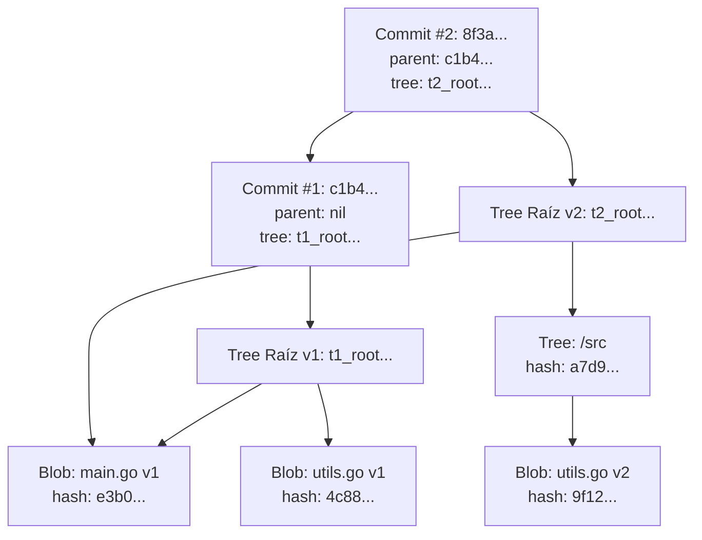

# Grafo de Merkle en MiniGit

## Concepto del Grafo de Merkle (Merkle DAG)

MiniGit organiza la información del repositorio mediante un **Grafo Acíclico Dirigido basado en Hashes Cryptográficos** (*Merkle Directed Acyclic Graph* o *Merkle DAG*). 

En un Grafo de Merkle:
- Los **nodos** representan objetos inmutables (`Blob`, `Tree` o `Commit`).
- Las **aristas (enlaces)** consisten en las referencias que contienen los objetos superiores almacenando el hash SHA-256 de los objetos inferiores.
- El grafo es **acíclico** porque las referencias son unidireccionales apuntando hacia objetos previamente existentes o hashes inmutables, imposibilitando ciclos.

---

## Relación entre Nodos: Commit, Tree y Blob

La jerarquía del Grafo de Merkle en MiniGit consta de tres niveles fundamentales:

1. **Nivel Histórico (`Commit`)**:
   - Cada objeto `Commit` apunta al hash de su **`Tree` raíz** (el estado completo del área de trabajo en ese momento).
   - Apunta también al hash de su **`Commit` padre** (excepto en el commit inicial), construyendo la cadena lineal o ramificada de la historia del repositorio.

2. **Nivel Estructural (`Tree`)**:
   - Representa directorios y subdirectorios.
   - Un `Tree` contiene una lista de punteros hashes hacia objetos `Blob` (archivos individuales) u otros objetos `Tree` (subcarpetas).

3. **Nivel de Contenido (`Blob`)**:
   - Constituye las hojas (*leaf nodes*) del grafo.
   - Contiene únicamente el contenido binario o de texto de los archivos sin metadatos.



---

## Enlazamiento mediante Hashes SHA-256

El principio rector del almacenamiento direccionable por contenido (*Content-Addressable Storage*) es que la identidad de un objeto depende exclusivamente de su contenido exacto.

### Propagación de Hashes e Integridad Transitiva

1. Si el usuario modifica **1 solo carácter** en un archivo (ejemplo: `utils.go`), el hash SHA-256 de su `Blob` cambia drásticamente.
2. Al cambiar el hash del `Blob`, la entrada del directorio contenedor (`/src`) dentro de su objeto `Tree` correspondiente cambia.
3. Al cambiar el cuerpo del objeto `Tree` de `/src`, el hash del `Tree` raíz cambia.
4. Al cambiar el hash del `Tree` raíz, el objeto `Commit` resultante registrará un hash único e irrepetible.

Esta propiedad asegura la **integridad criptográfica completa**: es absolutamente imposible alterar el contenido de un archivo histórico o de un commit antiguo sin alterar el hash de todos los nodos superiores en la cadena.

---

## Ejemplo Gráfico del Recorrido de Objetos

A continuación se muestra un ejemplo detallado de un repositorio con la estructura:
```text
.
├── README.md
└── src/
    └── app.go
```

### Diagrama del Grafo de Merkle Completo

```text
[Ref: refs/heads/main] ──────► [Commit: 7a9f4c...]
                                      │
                                      ▼
                               [Tree Raíz: 3b1e2a...]
                                ├── "README.md" ──► [Blob: f819ab...] ("# Proyecto")
                                └── "src" ────────► [Tree Subfolder: c4d8e9...]
                                                        └── "app.go" ──► [Blob: 1a2b3c...] ("package main...")
```

### Proceso de Despliegue / Recorrido (Checkout / Status)

Cuando MiniGit ejecuta operaciones como `checkout` o `status`, realiza un recorrido recursivo del Merkle DAG:

```text
1. Leer HEAD ──► Obtener Hash Commit (ej: 7a9f4c...)
2. Descodificar Commit 7a9f4c... ──► Extraer Hash del Tree Raíz (3b1e2a...)
3. Leer y Descodificar Tree Raíz 3b1e2a...
   ├── Entrada "README.md": Tipo Blob (f819ab...) ──► Reconstruir archivo en directorio de trabajo.
   └── Entrada "src": Tipo Tree (c4d8e9...)
        └── Leer y Descodificar Sub-Tree c4d8e9...
             └── Entrada "app.go": Tipo Blob (1a2b3c...) ──► Reconstruir src/app.go.
```

---

## Reutilización Eficiente de Objetos Nativos

Debido a que los objetos son direccionables por contenido, si dos archivos en directorios diferentes (o a lo largo de diferentes commits) poseen exactamente el mismo contenido, **ambos compartirán el mismo objeto Blob en `.minigit/objects/`**.

MiniGit no duplica contenido idéntico, reduciendo el consumo de almacenamiento en disco y acelerando las comparaciones entre árboles mediante simples cotejos de hashes de 64 caracteres hex.
